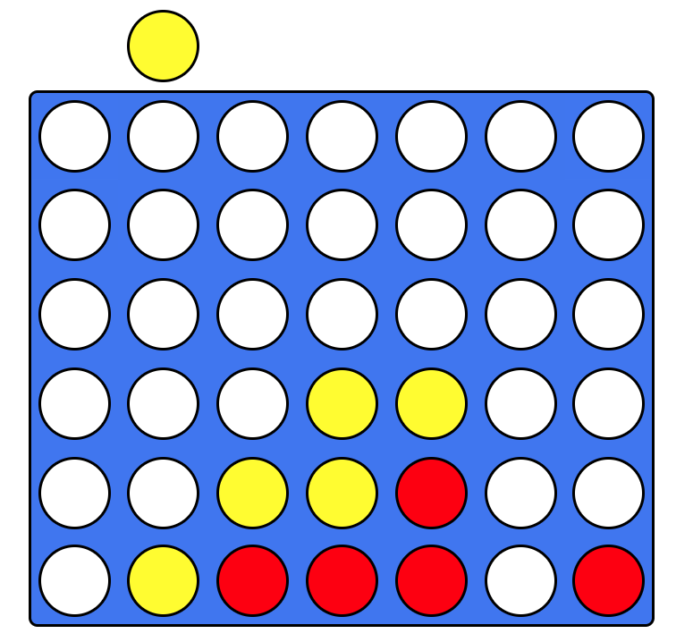
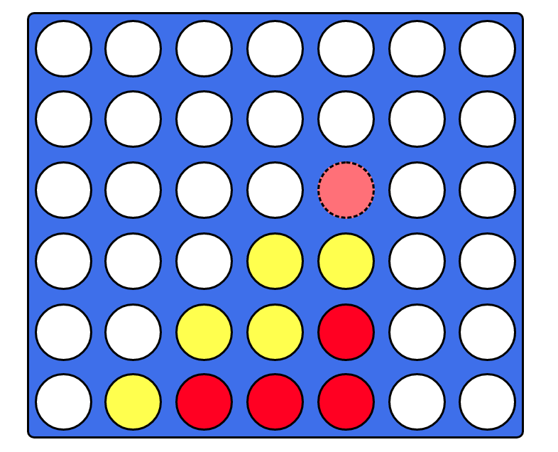

# Connect-Four
First project in JavaScript, followed a tutorial and added some of my own functionality. For educational purposes.

I followed Justin Kims tutorial on youtube:

https://www.youtube.com/watch?v=Hi5hEH1KNEc

Here is an image from Justin Kim's original:

## Personal additions

I wanted the player to be able to see exactly where their next marker would be placed, so instead of highlighting the column like the tutorial I now show a preview with low opacity and dashed border to illustrate where the players marker will be placed.

## Acknowledgments

* Hat tip to to Justin Kim for creating the tutorial
